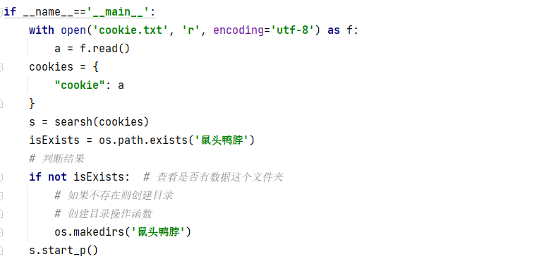

# 微博舆情分析全栈toolkit（保姆级教程，零使用门槛，爬虫+情感分类数据集+NLP+可视化，一个工具箱全部搞定）
本项目toolkit设计图：


python 版本：Python 3.10.2

注意版本不同可能导致运行时bug

前置准备：将本项目使用git克隆到本地或者直接下载代码

安装依赖： 在Pycharm Terminal（或其他命令行工具）中运行 
```
pip install -r requirements.txt
``` 
也可手动逐个安装

使用时请先关闭VPN，否则可能会使部分模块报错

**在研究中使用本项目中的资源需要标引来源。**
## 微博博文多字段高速爬虫（可爬IP属地，速度百万条/日）
***本爬虫仅供研究者进行小型研究使用，禁止用于任何非法用途***

请在crawler.py中进行调试。爬虫部分主体代码并非本人所写，API做的很烂，所以使用时需要手动调整输入，但是数据获取速度非常好
，支持以小时为时间粒度爬取，能有效避免获取到的数据都挤在某一时间段内。
支持多线程，可以获取微博**博文**的用户名、发布时间、IP属地、微博正文、转发数、评论数、点赞数等字段，
对于普通的舆情分析任务已经够用了，实测比github上大多数开源爬虫都要更快，并且性能稳定。

下面详细讲解使用方法：
### 获取代理IP
由于微博存在反爬机制，在固定时间内大量访问会导致封号，我们需要使用代理IP来爬取大量数据

这里以熊猫代理为例（不是广告，也可以用自己喜欢的代理IP网站，都一样）

进入网站https://www.xiongmaodaili.com/ ，进行代理IP的购买，三块钱一千个IP，比较合算


在购买完成后，进入个人主页找到订单，然后点击生成API：


提取数量越多，越利于爬取大量数据，但为了避免浪费，我们一般设置为线程数的偶数倍，比如线程数设置为20，那么提取数量可以设置为40
（后面讲解），
注意生成格式选择txt，然后把这个API链接复制下来一会使用


### 获取微博cookie（每次爬数据之前重新做一下这个工作）
首先你需要在自己的电脑上安装一个chrome浏览器，然后进入https://weibo.com/ ，登录自己的微博账号。注意不要有任何后缀，只在导航栏中保留weibo.com


随后按F12或点击浏览器右上角三个点，找到更多工具>开发者工具，选择Network：


然后点击浏览器左上角刷新页面，刷新时一定要保证导航栏中只有weibo.com而不含有其他后缀：


此时刚才的页面出现weibo.com，单击：


在Request Headers中找到Cookie，把这整个一坨都复制下来，粘贴到cookie.txt文件中，这个文件要和
crawler.py在一个文件夹下，注意往里复制之前先把里面之前的内容删一下:


### 微调代码
#### 修改爬取关键词
找到search类开头处的word_list变量，设置单个想要爬取的关键词，这里以鼠头鸭脖为例：

#### 修改代理IP的获取API
找到search类开头处的aip_list （忽略这个变量命名错误hhh），把之前复制下来的API链接作为一个字符串整个粘贴进去， ：


#### 修改年份
找到search类的jx_text方法（该死的拼音命名...），将此处的2023改为获取数据相应的年份，
这里其实很不方便，因为如果要跨年获取的话就得分多次爬：


#### 修改文件夹名称
这个需要改几个地方，但几个地方要保持完全一致

首先是search类的split_time方法，将下面的鼠头鸭脖改成喜欢的的命名：


再将代码末尾的几个”鼠头鸭脖“都改成一样的命名，代码运行完成后，获取的数据将以csv文件的形式存放在这个文件夹下（没有的话会自动创建）


#### 修改爬取时间粒度
这个所谓的时间粒度其实就是爬取的单位时间（以小时为最小粒度），比如设置成4，就是每4小时的数据存放在一个csv文件中
：
修改split_time方法，把那两个4设置成想要的时间粒度即可：


#### 设置线程数量
从search类的start方法中调整一般代理IP的数量最好设置成线程数量的偶数倍，代理IP越多，能获取的数据上限就越多
一般可以尝试20线程数，代理IP数设置为100，如果IP数目不够（进入死循环并且不再获取数据），那就再加

下面的flag代表线程数：


#### 设置爬取的时间范围：
把下面三处时间改为想要获取数据的时间范围，注意第一处的时间格式和下面两处不同，即不用补0。时间格式必须严格按模板来，不能随意丢弃空格：


做完上述工作后，运行crawler.py即可获取数据，程序将自动在当前文件夹下建立一个存储数据的文件夹，数据以csv文件的形式存储
## 数据清洗脚本

用我们的爬虫把数据爬下来之后可以直接调用函数进行数据清洗，该数据清洗函数经过反复校验，效果极好，清洗完后能直接喂给模型进行推理或训练

使用方法如下：
```commandline
import pandas as pd
from data_cleaning import clean_weibo_comment_data
df = pd.read_csv(r"...")  # 需要传入csv文件的路径
df = clean_weibo_comment_data(df,"微博正文")  # 传入的第二个参数为文本列的列名
```

## 句嵌入+情感分类模型（基于Ernie大模型），十行代码使用大语言模型进行舆情分析+作图
API参数详见源码，有详细注释，这里只给出demo

情感分类模型权重链接：https://drive.google.com/file/d/1kXjfj1zQKs-R9-ksZp8tEGuokQ2RMfn6/view?usp=drive_link

使用前先将模型权重下载到本地

本项目提供句嵌入模型和情感分类模型的API，情感分类可分为正性、负性、中性三分类或正性、中性、吐槽、伤心、恐惧、愤怒六分类，其中三分类较为实用

### 情感分类任务API
```
from weibo_nlp_model_api import ErnieWeiboSentiment
import pandas as pd
from data_cleaning import clean_weibo_comment_data
from data_convert import pie_data_aggregrate

weight_path = r"..." # weight_path为权重下载的本地路径
model = ErnieWeiboSentiment(weight_path=weight_path)  

df = pd.read_csv(r"...")  # 读入爬取到的文件
df = clean_weibo_comment_data(df,"微博正文") #进行数据清洗
text_list = list(df["微博正文"]) # 将微博正文列取出转化为列表

output = model.predict(text_list, batch_size=15) # 批量读入并推理，返回二元组：（文本列表, 情感标签列表）
sentence_list, labels = output

df_sentiment = pie_data_aggregrate(labels,6) # 格式转化，选择6分类，则第二个参数传入6，也可选择3分类
pie_chart_json = pie_chart(df_sentiment,return_dict=True) # 参数return_dict指定是否返回图片的json文件
```
情感分类任务效果图：


### 句嵌入API
本项目提供了两个句嵌入API，分别是ErnieWeiboEmbeddingSentiment和ErnieWeiboEmbeddingSemantics，前者在微博情感分类数据集上进行了微调，导致对语义不敏感而对情感敏感，如果不进行情感分类任务，请使用后者

本项目的句嵌入是基于shibing624/text2vec-base-chinese-paraphrase进行微调或直接封装的，可将长度小于等于256字的中文文本嵌入为768维句向量，这些向量可用于其他NLP下游任务

关于shibing624的项目，详见 https://github.com/shibing624/text2vec

当文本长度不为256字时，模型会自动填充或裁剪，不需要手动调整，embedding_list为句嵌入结果

```commandline
from weibo_nlp_model_api import ErnieWeiboEmbeddingSentiment, ErnieWeiboEmbeddingSemantics
import pandas as pd
from data_cleaning import clean_weibo_comment_data

df = pd.read_csv(r"...")  # 读入爬取到的文件
df = clean_weibo_comment_data(df,"微博正文") #进行数据清洗
text_list = list(df["微博正文"]) # 将微博正文列取出转化为列表

# 使用 ErnieWeiboEmbeddingSentiment 进行句嵌入，推荐用于情感分类下游任务
# weight_path = r"..." # weight_path为权重下载的本地路径
# model = ErnieWeiboEmbeddingSentiment(weight_path=weight_path)
# output = model.encode(text_list)
# sentence_list, embedding_list = output  # embedding_list为n*768的矩阵，n为句子个数，每行为一个句向量

# 使用 ErnieWeiboEmbeddingSemantics 进行句嵌入，推荐用于涉及到语义的下游任务
weight_path = "shibing624/text2vec-base-chinese-paraphrase" # 这里不要改动
model = ErnieWeiboEmbeddingSemantics(weight_path=weight_path)
output = model.encode(text_list)
sentence_list, embedding_list = output  # embedding_list为n*768的矩阵，每行为一个句向量
```

## 舆情可视化（舆情数量走势，三维可视化散点图，地图）
### 舆情数量走势图
使用API count_over_days，样例如下：
```commandline
from weibo_visualize import count_over_days
import pandas as pd

df = pd.read_csv(r"...")  # 读入爬取到的文件，注意该文件在爬取时需要设置“天”为最小时间粒度，即24小时
df = clean_weibo_comment_data(df,"微博正文") #进行数据清洗

count_over_days(df,title="疫情放开走势图") #作图题目自拟，函数参数详见代码，有详细注释
```
效果图：


### 基于cosine-kmeans的观点聚类与可视化
本项目提供余弦相似度的kmeans算法

#### 手肘法API
关于k-means算法使用手肘法判断最佳聚类数的方法，可以自行查询资料，大致意思是SSE曲线的“拐点”处对应的横坐标为最佳聚类数。

API样例如下：
```commandline
from weibo_visualize import elbow_visualize
## 获取embedding_list，见句嵌入API
...
##
elbow_visualize(embedding_list)
```
效果：


#### 摒弃手肘法，基于Kneedle的自动cosine-kmeans搜参
利用Kneedle算法，我们可以自动寻找拐点，这样就无需使用手肘法确定最佳聚类数
API样例如下
```commandline
from ml_algorithms import kneedle_cosine_kmeans
## 获取embedding_list，见句嵌入API
...
##
cosine_kmeans = kneedle_cosine_kmeans(embedding_list) # 返回的是一个cosine_kmeans对象，表现与sklearn的kmeans对象基本一致，详见源码注释
```

## 情感六分类数据集，可供在其他模型上微调，可合并为正负中三类情感
我们标注了接近25000条微博博文中长文本的情感分类数据，可供大家对自己的模型进行微调：


数据集的特色是情感六分类，情感标签分别是正向：0，无情绪：1，吐槽：2，伤心：3，恐惧：4，愤怒：5

如果只想要正性、负性、中性三个类别，那么只需要将后四个类别进行合并即可

数据存储在test_data.csv和tran_data.csv中